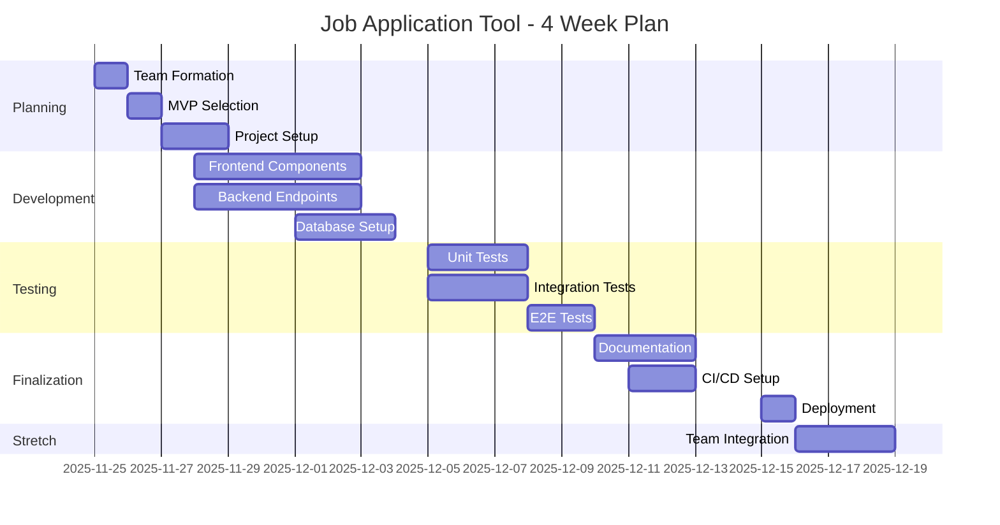

# KeyCV

**Build a tool to help you automate or improve a part of your job application process.**

## Tech stack

Front end: React

Back end: Node.js with express

Architecture: 2 repos

Language: Typescript

Testing: Vitest for integration tests, Playwright/Cypress for E2E tests

Database: Supabase
___

## Focus

- Testing
- Maintainable code - a focus on modularity and re-usable components
- Your backend endpoints should be available for another team (swagger)

## Requirements

- Using a project management tool to define tickets and estimate tasks e.g. Github projects
- Swagger and README documentation
- At-least one form of testing
- Your site must be deployed on a platform of your choice (Vercel / Replit / Netlify)

## Approach

### Project management

The scope and estimation of this project are going to be very challenging as we only have 4 weeks.

So when you come up with your app idea, I want you to choose the primary feature (quite possibly a single user flow) and make that your MVP. You should aim to implement this feature well, with good project planning, thoughtful implementation, and comprehensive documentation.

Strong recommendation to look at your task estimation and make sure that the total estimation for the MVP does not exceed the total capacity of team mates for your Tuesday sessions.

**For example:**

If you assume that you have 5 active coding hours a week and 4 developers, you have 80hrs total to complete the MVP

If for example you choose to estimate using time: you could say 1 Estimation Point = 2hrs
Then you have 40pts total to assign to tasks for your MVP → aiming to have some left over points for tasks you didn’t think about is also probably a good idea.

This way, the time you spend working on this project out of class time is a bonus

Only once you have some testing and documentation for your MVP should you move on to post-MVP work.

### Technical

- For your technical approach, aim to deploy soon (ideally when you set up your repo) → get a `hello world` showing on your deployed site. Maybe you have `main`  (where you make sure your code works once merged) and a `deploy`branch (that you push your code to in order to go live)

- I’d also get your testing libraries up and running ASAP. Write a unit and E2E test for your `hello world` app before you even start making components. This way all of your infrastructure and team scripts, and config is set up for the whole team before you start trying to build anything

</aside>

## Optional technical approaches to explore

These are stretch goals relating to you technical approach to the task

- Optional Test Driven Development: This is where you write a test for the output that you are expecting before you start writing the solution.
- Github actions: This could be particularly useful as you can write a GitHub action that automatically runs tests when you make a PR for example.
- PR templates

## Post-MVP Stretch goal

Build an additional page or UI component that connects to another teams endpoints and uses some of their server functionality.`

## Job Application Automation Tool - Project Plan

1\. 📌 Project Overview
**Goal**: Build a tool to automate/improve part of the job application process
**Tech Stack**: React (Frontend) | Node.js/Express (Backend) | TypeScript | Supabase | Vitest/Playwright

## 🗺️ Project Roadmap

### Week 1: Foundation & Planning

- [✅] Team formation & role assignment
- [✅] Select focused MVP (e.g., Resume Tailoring Assistant)
- [✅] Create GitHub Project board with estimation system (1pt = 2hrs)
- [ ] Set up repositories with TypeScript templates
- [ ] Deploy "Hello World" to Vercel/Netlify
- [ ] Configure testing frameworks (Vitest + Playwright)
- [ ] Write first test for basic deployment

### Week 2: Core Development

- [ ] Implement frontend components:
  - `JobPostingInput` (5pts)
  - `ResumeUpload` (5pts)
  - `TailoringResults` (8pts)
- [ ] Build backend endpoints:
  - `POST /analyze` (8pts)
  - `GET /keywords` (5pts)
- [ ] Set up Supabase database schema

### Week 3: Integration & Testing

- [ ] Connect frontend/backend
- [ ] Implement database integration
- [ ] Write comprehensive tests:
  - Unit tests (80% coverage)
  - Integration tests
  - E2E tests for critical flows
- [ ] Create Swagger documentation

### Week 4: Polish & Deployment

- [ ] Final testing and bug fixes
- [ ] Complete README documentation
- [ ] Set up CI/CD pipeline
- [ ] Deploy to production
- [ ] (Stretch) Integrate with another team's API

## 📊 Workflow Diagram

