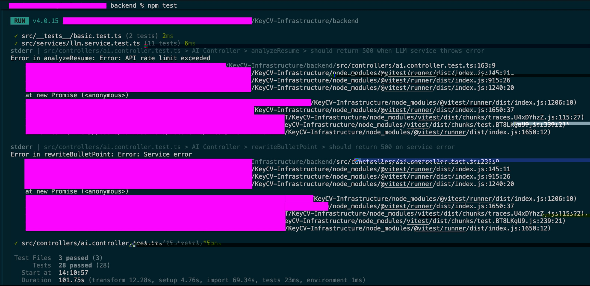
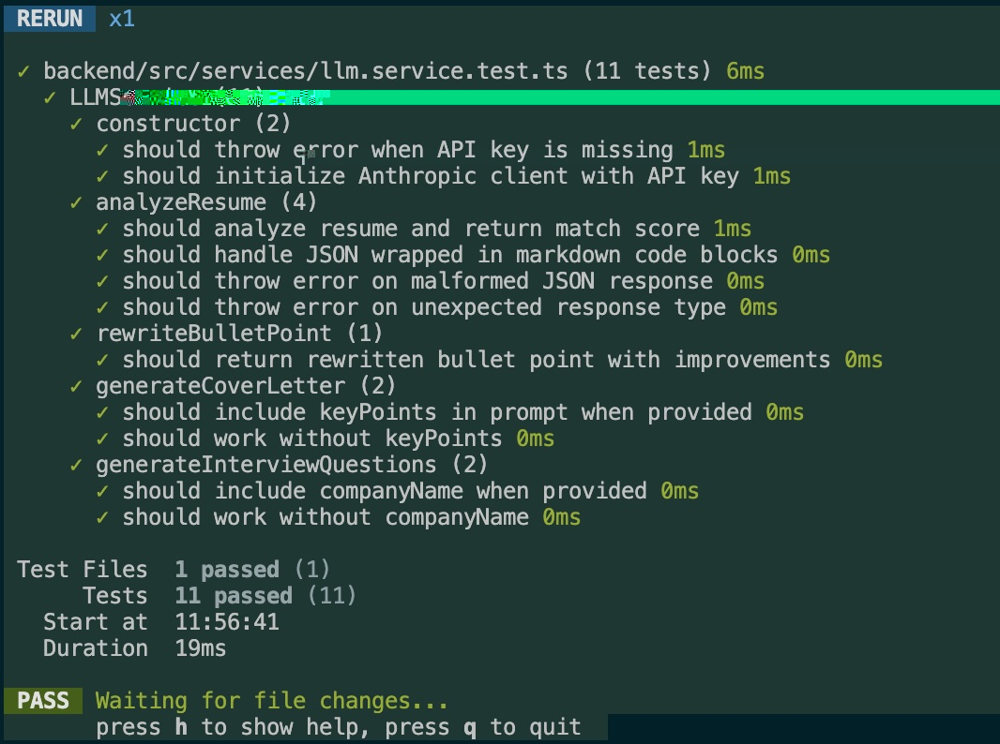

# 🔑 KeyCV

This repository houses the backend service for the KeyCV application,
designed to automate and improve parts of the job application process.
The frontend (if in a separate repository) would consume this backend's APIs.

## Backend Service Overview

The backend service is built with Node.js, Express, and TypeScript. Its primary responsibilities
include processing job application data and providing API endpoints for the frontend.

## Tech Stack (Backend)

- ⏱️ **Runtime:** Node.js
- 🖼️ **Framework:** Express.js
- ⚖️ **Language:** TypeScript
- 📦 **Package Manager:** npm

## Setup Instructions

Follow these steps to get the **backend service** running on your local machine.

### 1. Clone the repository

First, clone this entire repository:

```bash
git clone https://github.com/fac-32/KeyCV-Infrastructure.git
cd KeyCV-Infrastructure
```

### 2. Navigate to the Backend Directory

All subsequent backend commands should be run from within the `backend/` directory:

```bash
cd backend
```

### 3. Install Dependencies

Install the necessary Node.js packages for the backend:

```bash
npm install
```

### 4. Environment Variables

Environment variables are crucial for configuring our application.
We use a `.env.example` file as a template to define all necessary variables.

For local development, create a `.env.local` file in the `backend/` directory:

```bash
cp .env.example .env.local
```

Then, open `.env.local` and fill in the required environment variables specific to your local setup.

> 🚨 **Warning:** </br>
> **Ensure this file is never committed to Git, as it contains sensitive information.**
(It is already ignored by `.gitignore`). On Render, add these variables via the dashboard.

### 5. Run the Development Server

To start the backend server in development mode with live reloading:

```bash
npm run dev
```

The `npm run dev` command uses `nodemon` to watch for changes in your source files (`src/`). It will
automatically recompile your TypeScript code and restart the server, loading environment variables
from `.env.local`.

> **Note:**</br>
> The server will typically run on `http://localhost:3000`.

### 6. Build the Project

To compile the TypeScript code of the backend into JavaScript for production:

```bash
npm run build
```

This command compiles the TypeScript source files (`src/`) into JavaScript in the `dist/` directory.

### 7. Start the Production Server

To run the compiled production version of the backend server:

```bash
npm start
```

## Available Scripts (Backend)

These scripts are run from within the `backend/` directory.

- `npm run dev`: Starts the backend server in development mode with live reloading.
It automatically recompiles TypeScript changes and loads environment variables from `.env.local`.
- `npm run build`: Compiles TypeScript to JavaScript for the backend, creating production-ready
files in the `dist/` directory.

- `npm start`: Starts the compiled production backend server.
- `npm test`: Runs the complete test suite using Vitest.
- `npm run test:watch`: Runs tests in watch mode for development.
- `npm run test:ui`: Opens the Vitest UI for interactive testing.
- `npm run test:coverage`: Generates test coverage reports.

For contribution guidelines, including our Git branching model and commit message conventions,
please refer to our [CONTRIBUTING.md](CONTRIBUTING.md) guide.

## Testing

We use **Vitest** as our testing framework, providing a fast and modern testing experience
with TypeScript support.

### Test Structure

Our test suite is organized into three main categories:

1. **Unit Tests** (`src/**/*.test.ts`)
   - Service layer tests (LLM service, business logic)
   - Utility function tests
   - Individual component testing

2. **Integration Tests** (`src/controllers/*.test.ts`)
   - API endpoint testing
   - Controller logic with mocked services
   - Request/response validation

3. **Basic Tests** (`src/__tests__/*.test.ts`)
   - Smoke tests
   - Environment validation
   - Configuration checks

### Running Tests

```bash
# Run all tests once
npm test

# Run tests in watch mode (re-runs on file changes)
npm run test:watch

# Open interactive UI for test exploration
npm run test:ui

# Generate coverage report
npm run test:coverage
```

> All test runs from backend

### Test Configuration

- **Framework:** Vitest v4.0.15
- **Environment:** Node.js
- **Coverage Tool:** v8
- **Mocking:** vi (Vitest's built-in mocking utilities)
- **Globals:** Enabled (no need to import describe, it, expect)

### Coverage Thresholds

We maintain minimum coverage thresholds:

- **Lines:** 70%
- **Functions:** 70%
- **Branches:** 70%
- **Statements:** 70%

### Test Results



> All 28 tests passing across 3 test suites*

### Test UI



### Writing Tests

When adding new features, please include corresponding tests:

```typescript
import { describe, it, expect, beforeEach, vi } from "vitest";

describe("FeatureName", () => {
  beforeEach(() => {
    // Setup code
  });

  it("should do something expected", () => {
    // Arrange
    const input = "test";

    // Act
    const result = yourFunction(input);

    // Assert
    expect(result).toBe("expected");
  });
});
```

### Mocking External Dependencies

We mock external services (like the Anthropic API) to ensure fast, reliable tests:

```typescript
// Mock the Anthropic SDK
const { mockCreate } = vi.hoisted(() => ({
  mockCreate: vi.fn(),
}));

vi.mock("@anthropic-ai/sdk", () => ({
  default: vi.fn(function() {
    return {
      messages: { create: mockCreate },
    };
  }),
}));
```

## Deployment

[Live Here](https://keycv.onrender.com/)

We deploy the backend on Render as a Web Service:

- **Root Directory:** `backend`
- **Build Command:** `npm install && npm run build`
- **Start Command:** `npm start`
- **Node version:** set `NODE_VERSION` to `20` (or higher) in Render environment variables.
- **Health Check:** `/health` (Render will automatically use this for service status).

See [Deployment Guide](docs/deployment.md) for step-by-step Render setup details.

You can access the live application after Render finishes provisioning and exposes the service URL.

## Project Documentation

All detailed project documentation has been moved to the `docs/` directory keeping root directory clean.

- **[Project Guidelines](docs/GUIDELINES.md):** High-level project goals, tech stack, and project
management approach.
- **[Deployment Guide](docs/deployment.md):** Detailed instructions for deploying the backend service
at Render.
- **[Project Plan Gantt Chart](docs/gantt.html):** A visual representation of our project plan.
- **[AI Toolkit](docs/AI_Toolkit.md):** Suggestions for leveraging AI to enhance the application's capabilities.

## Meet the Team

| Name          | GitHub                                           | Email                   |
|---------------|--------------------------------------------------|-------------------------|
| Kay           | `[add GitHub username]`                          | `[add email]`           |
| Marina        | `[add GitHub username]`                          | `[add email]`           |
| Rafi          | `[add GitHub username]`                          | `[add email]`           |
| Tania Rosa    | [Pinkish-Warrior](https://github.com/Pinkish-Warrior) | `trsdeveloper@proton.me`|


